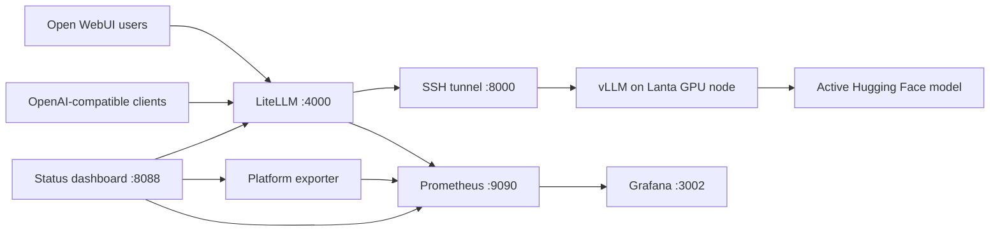

<div align="center">

# Lanta LLM Hosting

**Run a private, OpenAI-compatible LLM platform on Lanta HPC with a stable API,
a browser chat interface, and production-minded observability.**

[](https://docs.docker.com/compose/)
[](https://docs.vllm.ai/)
[](https://docs.litellm.ai/)
[](https://openwebui.com/)
[](#validation)

[Quick start](#quick-start) · [Architecture](#architecture) ·
[Operations](#operations) · [Documentation](#documentation)

</div>

Lanta LLM Hosting connects a GPU model running under Slurm to a local Windows
control plane. Users see one durable model name, `active-lanta-model`, while
administrators can replace the underlying model without reconfiguring clients.

It brings together:

- **vLLM on Lanta** for GPU inference.
- **A self-healing SSH tunnel** that follows the active Slurm compute node.
- **LiteLLM** for the stable model alias, virtual keys, budgets, and metrics.
- **Open WebUI** for authenticated browser chat.
- **Prometheus and Grafana** for health, usage, latency, tokens, and errors.
- **A compact status dashboard** for operational checks and admin links.

> [!IMPORTANT]
> This repository is infrastructure for a specific Lanta account and Windows
> host workflow. Review the remote project path, Slurm directives, secrets, and
> model storage paths before using it in another environment.

## Architecture



### Stable model contract

Clients always request:

```text
active-lanta-model
```

LiteLLM maps that alias to the model currently served by vLLM. This separates
the public API contract from model deployment details:

```text
Client model name              active-lanta-model
LiteLLM backend configuration  openai/<served-model-name>
vLLM served model              selected Lanta preset
```

The tunnel watchdog queries Slurm, discovers the active compute node, and
reconnects when a replacement job starts elsewhere.

## Features

| Capability | What it provides |
| --- | --- |
| Model presets | Reproducible vLLM settings for supported coding models |
| Reasoning support | Qwen 3.5/3.6 presets enable the vLLM `qwen3` reasoning parser |
| Stable endpoint | One OpenAI-compatible alias across backend model swaps |
| Resilient tunnel | PID recovery, duplicate-start protection, and node-change detection |
| Browser chat | Persistent Open WebUI users, settings, and conversations |
| API governance | LiteLLM virtual keys, budgets, usage records, and PostgreSQL storage |
| Observability | Provisioned Prometheus targets and a Grafana operations dashboard |
| Health view | Status page for Open WebUI, LiteLLM, vLLM, exporter, and monitoring |
| Controlled sharing | Open WebUI and authenticated compatibility sharing helpers |

## Prerequisites

### Windows host

- Windows PowerShell 5.1 or PowerShell 7.
- Docker Desktop with Docker Compose.
- OpenSSH with an SSH config alias named `lanta`.
- Network access to the Lanta login node.

### Lanta

- A Slurm account with access to GPU nodes.
- A Python environment containing vLLM.
- Model files under the configured project directory.
- This repository's `lanta/scripts/` copied to:

  ```text
  /project/zz992000-zdevb/zz992005/ub127/SiliconCraft/scripts
  ```

Test the SSH alias before continuing:

```powershell
ssh lanta "hostname; squeue -u ub127"
```

## Quick Start

### 1. Configure local services

Create local environment files from the safe examples:

```powershell
Copy-Item litellm\.env.example litellm\.env
Copy-Item openwebui\.env.example openwebui\.env
Copy-Item observability\.env.example observability\.env
Copy-Item dashboard\.env.example dashboard\.env
```

Replace every `change-this-...` value with a strong secret. The LiteLLM master
key used by Open WebUI must match the key configured in `litellm/.env`.

> [!CAUTION]
> Never commit `.env` files, generated API keys, `.webui_secret_key`, model
> weights, or service data. They are intentionally excluded by `.gitignore`.

### 2. Submit the model

The recommended daily RTL model is Qwen3.6-27B:

```powershell
ssh lanta "cd /project/zz992000-zdevb/zz992005/ub127/SiliconCraft && bash scripts/submit-preset.sh qwen36-27b"
ssh lanta "squeue -u ub127"
```

If the model is not downloaded yet:

```powershell
ssh lanta "cd /project/zz992000-zdevb/zz992005/ub127/SiliconCraft && MODEL_REPO=Qwen/Qwen3.6-27B bash scripts/download-model.sh"
```

### 3. Start the tunnel

```powershell
powershell -ExecutionPolicy Bypass -File .\windows\tunnel\start-lanta-vllm-tunnel.ps1
powershell -ExecutionPolicy Bypass -File .\windows\tunnel\status-lanta-vllm-tunnel.ps1
```

Expected status:

```text
Watchdog: running
API:      online (HTTP 200)
```

### 4. Start the platform

The Compose projects share the `lanta-llm-platform` Docker network:

```powershell
docker compose -f litellm/docker-compose.yml up -d
docker compose -f openwebui/docker-compose.yml up -d
docker compose -f observability/docker-compose.yml up -d
docker compose -f dashboard/docker-compose.yml up -d --build
```

### 5. Verify everything

```powershell
$env:LITELLM_MASTER_KEY = "sk-your-master-key"
powershell -ExecutionPolicy Bypass -File .\scripts\check-platform.ps1
```

Open [Open WebUI](http://127.0.0.1:3000), create the first administrator
account, and select `active-lanta-model`.

## Service Map

| Service | URL | Audience |
| --- | --- | --- |
| Open WebUI | [127.0.0.1:3000](http://127.0.0.1:3000) | Chat users |
| LiteLLM API | [127.0.0.1:4000/v1](http://127.0.0.1:4000/v1) | API clients |
| vLLM tunnel | [127.0.0.1:8000/v1](http://127.0.0.1:8000/v1) | Local infrastructure |
| Status dashboard | [127.0.0.1:8088/status](http://127.0.0.1:8088/status) | Administrators |
| Platform exporter | [127.0.0.1:9108/metrics](http://127.0.0.1:9108/metrics) | Prometheus |
| Prometheus | [127.0.0.1:9090](http://127.0.0.1:9090) | Administrators |
| Grafana | [127.0.0.1:3002](http://127.0.0.1:3002) | Administrators |

## Supported Model Presets

| Preset | Model | Context | Reasoning parser |
| --- | --- | ---: | --- |
| `qwen36-27b` | Qwen/Qwen3.6-27B | 131,072 | `qwen3` |
| `qwen36-35b-a3b` | Qwen/Qwen3.6-35B-A3B | 131,072 | `qwen3` |
| `qwen3-coder-30b-a3b` | Qwen/Qwen3-Coder-30B-A3B-Instruct | 32,768 | None |
| `qwen25-coder-32b` | Qwen/Qwen2.5-Coder-32B-Instruct | 32,768 | None |
| `deepseek-coder-v2-lite` | deepseek-ai/DeepSeek-Coder-V2-Lite-Instruct | 32,768 | None |

Only one preset is served at a time. By default, submitting a new preset
cancels the existing `vllm-model` job. See [How to swap models](HOW_TO_SWAP.md)
for overrides and verification.

## API Usage

Use a LiteLLM virtual key rather than the administrator master key:

```powershell
$body = @{
  model = "active-lanta-model"
  messages = @(
    @{
      role = "user"
      content = "Write a four-cycle SystemVerilog repeat block."
    }
  )
  temperature = 0
  max_tokens = 512
} | ConvertTo-Json -Depth 10

Invoke-RestMethod `
  -Uri "http://127.0.0.1:4000/v1/chat/completions" `
  -Method Post `
  -Headers @{ Authorization = "Bearer sk-user-key" } `
  -ContentType "application/json" `
  -Body $body
```

Any OpenAI-compatible SDK can use:

```text
Base URL  http://<host>:4000/v1
Model     active-lanta-model
API key   <LiteLLM virtual key>
```

See [LiteLLM key management](docs/KEY_MANAGEMENT.md) for creating, budgeting,
listing, and revoking user keys.

## Operations

### Tunnel lifecycle

```powershell
# Status
powershell -ExecutionPolicy Bypass -File .\windows\tunnel\status-lanta-vllm-tunnel.ps1

# Stop watchdog and SSH child
powershell -ExecutionPolicy Bypass -File .\windows\tunnel\stop-lanta-vllm-tunnel.ps1

# Start or recover
powershell -ExecutionPolicy Bypass -File .\windows\tunnel\start-lanta-vllm-tunnel.ps1
```

Tunnel logs are stored under `windows/tunnel/.tunnel-runtime/`.

### Service lifecycle

```powershell
# Inspect
docker compose -f litellm/docker-compose.yml ps
docker compose -f openwebui/docker-compose.yml ps
docker compose -f observability/docker-compose.yml ps
docker compose -f dashboard/docker-compose.yml ps

# Stop without deleting persisted volumes
docker compose -f dashboard/docker-compose.yml down
docker compose -f observability/docker-compose.yml down
docker compose -f openwebui/docker-compose.yml down
docker compose -f litellm/docker-compose.yml down
```

> [!WARNING]
> Do not add `--volumes` unless you intentionally want to delete persisted
> Open WebUI accounts and chats, LiteLLM database records, and monitoring data.

### Observability

Grafana is the primary view for request volume, tokens, latency, and errors.
The status dashboard answers a different question: whether each platform
component is reachable and correctly configured.

Machine-readable status endpoints:

| Endpoint | Purpose |
| --- | --- |
| `GET /api/healthz` | Status dashboard process health |
| `GET /api/platform/status` | Full component and active-model health |
| `GET /api/platform/usage?window=1h` | Experimental usage summary |

## Sharing And Security

- Give browser users Open WebUI accounts.
- Give API users scoped LiteLLM virtual keys.
- Keep the LiteLLM master key administrator-only.
- Prefer a private network or authenticated Tailscale route.
- Never expose raw vLLM, Prometheus, Grafana, or the status dashboard publicly.
- Revoke leaked virtual keys immediately and rotate affected secrets.

The `sharing/` helpers exist for compatibility with the earlier authenticated
gateway flow. LiteLLM is the preferred API boundary.

## Troubleshooting

<details>
<summary><strong>The Slurm job is running, but localhost:8000 resets the connection</strong></summary>

The tunnel may still point to an earlier compute node. Restart the watchdog and
confirm its log names the node shown by `squeue`:

```powershell
powershell -ExecutionPolicy Bypass -File .\windows\tunnel\stop-lanta-vllm-tunnel.ps1
powershell -ExecutionPolicy Bypass -File .\windows\tunnel\start-lanta-vllm-tunnel.ps1
powershell -ExecutionPolicy Bypass -File .\windows\tunnel\status-lanta-vllm-tunnel.ps1
```

</details>

<details>
<summary><strong>LiteLLM does not list active-lanta-model</strong></summary>

Verify the tunnel first, then confirm `VLLM_MODEL_ID`, `VLLM_BASE_URL`, and
`LITELLM_MASTER_KEY` in `litellm/.env`. Restart LiteLLM after changing its
environment:

```powershell
docker compose -f litellm/docker-compose.yml up -d --force-recreate
```

</details>

<details>
<summary><strong>Open WebUI still uses old provider settings</strong></summary>

In the Open WebUI admin settings, point the OpenAI-compatible provider to
`http://litellm:4000/v1`. Keep the model name `active-lanta-model`. Avoid
deleting the Open WebUI volume just to refresh provider configuration.

</details>

<details>
<summary><strong>Qwen reasoning appears inside content or has only a closing think tag</strong></summary>

Confirm the Lanta startup log reports `Reasoning parser: qwen3`. Qwen chat
templates may prefill the opening thinking marker; with vLLM's `qwen3` parser
enabled, reasoning is returned separately from final response content.

</details>

## Repository Layout

```text
lanta/scripts/       Slurm submission, model download, and vLLM serving
windows/tunnel/      Self-healing Windows SSH tunnel
litellm/             API gateway, model alias, keys, and PostgreSQL
openwebui/           Browser chat deployment
observability/       Exporter, Prometheus, and Grafana provisioning
dashboard/           Operational status service
scripts/             Platform health and Lanta job helpers
sharing/             Compatibility sharing gateway and Funnel helpers
cli/                 PowerShell and Node.js chat clients
tests/               Runtime, dashboard, exporter, and configuration tests
docs/                Architecture and operational runbooks
```

Benchmark development is maintained separately in
[ArmmyC/RLTBench](https://github.com/ArmmyC/RLTBench).

## Validation

Run the repository checks:

```powershell
python -m pytest
python -m compileall dashboard observability
docker compose -f litellm/docker-compose.yml config --quiet
docker compose -f openwebui/docker-compose.yml config --quiet
docker compose -f observability/docker-compose.yml config --quiet
docker compose -f dashboard/docker-compose.yml config --quiet
```

The current suite covers model defaults, Qwen reasoning configuration, tunnel
watchdog behavior, platform status, and exporter metrics.

## Documentation

- [How to use the platform](HOW_TO_USE.md)
- [How to swap models](HOW_TO_SWAP.md)
- [Architecture](docs/ARCHITECTURE.md)
- [Operations runbook](docs/OPERATIONS.md)
- [Lanta vLLM setup](docs/lanta-vllm-setup.md)
- [Open WebUI setup](openwebui/README.md)
- [LiteLLM gateway](litellm/README.md)
- [Key management](docs/KEY_MANAGEMENT.md)
- [Friend CLI usage](docs/friend-cli-usage.md)
- [Default RTL model decision](docs/default-rtl-model.md)
